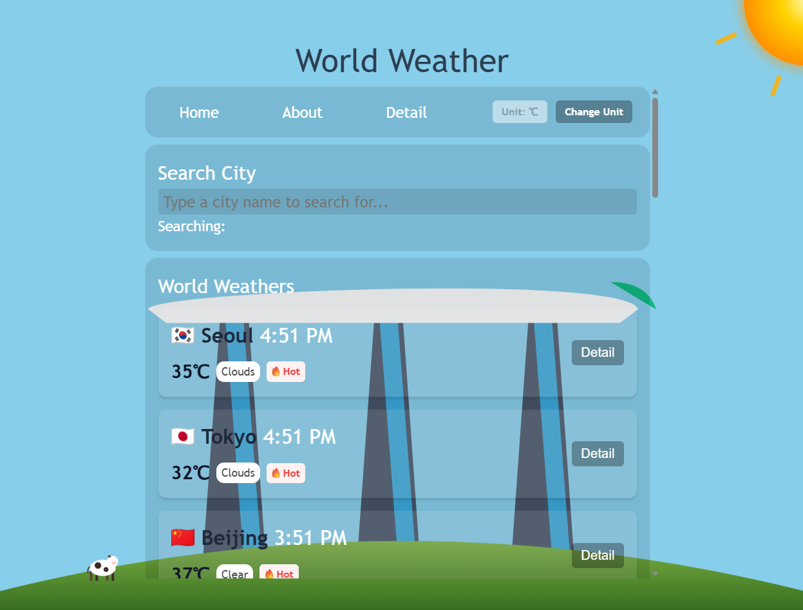

# skala-vue

https://skala-vue-delta.vercel.app/



A Vue 3 + Vite weather dashboard that fetches city weather data from OpenWeather and displays search, selection, and detail views.

## 구현한 기능 목록

- 세계 각국 주요 도시 20개의 날씨 조회 및 검색
  - OpenWeather API를 이용한 실시간 날씨정보 반영
  - Javascript의 Date()객체를 이용한 각 도시의 현재 시간 표기
- 선택한 도시에 따라 바뀌는 배경의 랜드마크와 날씨 (실제 날씨 반영)
- 앱에 대한 간단한 설명을 볼 수 있는 about 페이지
- 각 국의 날씨와 습도, 위도와 경도 등을 볼 수 있는 디테일 페이지
- 온도의 단위를 섭씨와 화씨 사이에서 변경할 수 있는 토글 버튼 기능

## 실행 방법

### Environment variables

Create a `.env` file at the project root with:

```env
VITE_OPEN_WEATHER_API=your_api_key_here
```

### Quick start

```sh
npm install
npm run dev
```

## 어려웠던 점과 해결 과정

- OpenWeather API가 로드될 때 까지 첫 화면이 비어보이던 문제
  - vue3-spinners 라이브러리를 활용한 로딩 스피너로 사용자 경험 향상
- app 컴포넌트에 overflow: scroll을 적용하자 y축 뿐만 아니라 x축으로도 scroll이 생기던 문제
  - app 컴포넌트 내부 요소들의 width가 app 컴포넌트의 width를 초과한다는 것을 깨닫고, 요소들 크기 조정 및 x축 스크롤바가 비어있는 것을 확인 후 overflow-y: scroll로 y축에만 스크롤바가 적용되도록 변경
- 초기 UI에 blur가 적용되어 있어 각 도시의 랜드마크 배경이 잘 안보이던 문제
  - 15px로 적용되어 있던 blur 속성을 완전히 제거하여 사용자가 각 도시의 랜드마크를 또렷하게 볼 수 있도록 날씨앱에 맞는 컨셉으로 변경
- 도시 전환 시 랜드마크 svg 렌더링이 버벅이던 문제
  - 기존의 js파일로 DOM에 직접 접근하여 DOM 요소를 생성하는 함수들로 작성했던 로직을 TheBackground.vue로 옮기고, vue스러운 방식으로 미리 만들어둔 template 요소들을 script로 조작하고 style을 적용하도록 변경
- 도시별 랜드마크 SVG의 사이즈가 제각각이어서 일일히 수정해야했던 문제
  - config/landmarkConfig.js의 landmarkPlacementConfigs에서 각 SVG의 크기와 위치를 설정하는 컨피그 객체를 만들어 해결
- 언덕과 소들이 화면 width에 따라 height의 변경 없이 width만 늘어나던 문제
  - 언덕과 소들의 svg 컴포넌트에 적용되어 있던 스타일 속성을 변경하여 상위 컴포넌트의 길이에 따라 높이와 너비가 같이 변하도록 변경

## Project structure highlights

- `src/main.js` — app bootstrap
- `src/App.vue` — root layout and global loading state
- `src/router/index.js` — route definitions
- `src/stores/weatherStore.js` — weather API calls and data storage
- `src/stores/backgroundStore.js` — selected city background control
- `src/views/WeatherHomeView.vue` — search and city card dashboard
- `src/views/WeatherDetailView.vue` — detailed weather view per city
- `src/assets/cities.json` — predefined city metadata for API queries

Open the local URL shown in the terminal.

## Build & preview

```sh
npm run build
npm run preview
```

## Scripts

- `npm run dev` — start the Vite development server
- `npm run build` — build production assets
- `npm run preview` — locally preview the built app
- `npm run lint` — run lint scripts (`lint:oxlint` and `lint:eslint`)
- `npm run format` — format source files with Prettier

## Dependencies

- `vue`
- `pinia`
- `vue-router`
- `axios`
- `vue3-spinners`
- `dotenv`

## Development dependencies

- `vite`
- `eslint`
- `@eslint/js`
- `eslint-plugin-vue`
- `prettier`
- `oxlint`
- `npm-run-all2`
- `vite-plugin-vue-devtools`
- `vue-eslint-parser`

## Notes

- The weather data is loaded from OpenWeather by latitude/longitude values in `src/assets/cities.json`.
- Select a city card to update the background and open the detail page.
- If the API request fails, the app shows an error message.
